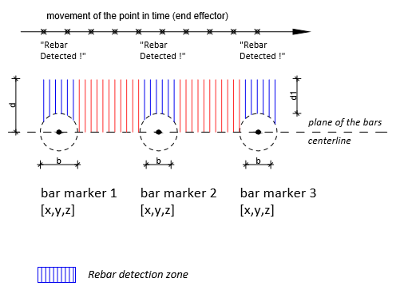

# Robotic Rebar Detection Simulation in ROS2/RVIZ  





## Table of Contents
- [Introduction](#introduction)
- [System Overview](#system-overview)
- [Robot Model and Environment](#robot-model-and-environment)
- [Control Package](#control-package)
- [Simulation Results](#simulation-results)
- - [Setting Up the Package](#setting-up-the-package)
  - [Running the Package](#running-the-package)
- [Conclusion](#conclusion)


## Introduction
This repository presents a simulation of a robotic process for on-site assessment and non-destructive testing of existing concrete elements in a construction scenario. The simulation aims to automate the assessment process to enhance effectiveness and obtain high-quality structural information.

## System Overview
The simulation is based on the Robot Operating System (ROS), enabling communication and integration between the robot and building elements. The robotic process involves detecting rebar in reinforced concrete walls. The simulation generates data that can be used for accurate structural assessment and even for integration with Building Information Modeling (BIM).

## Robot Model and Environment
The robot used in the simulation is a Kuka robot arm with six links and five joints. The environment consists of walls with various configurations. The robot arm can move around the environment to scan and assess the structural properties of the walls.

## Control Package
The control package comprises several nodes and scripts that work together to ensure the robot's movement and data processing. Notably, the `jointstate_joystick.py` node translates joystick commands into joint movements for the robot. Custom nodes like `wall.py`, `bar.py`, and `environment.py` create elements in the environment and represent rebar inside the walls. The `Launch.py` script manages the life cycle of the package.

## Simulation Results
The simulation generates realistic scenarios where the robot detects rebar in walls. The `Distance_Calculator.py` code simulates rebar detection using ROS Client Library and Transform Library. Detected rebar information is stored in a CSV file for analysis.

## Requirements

To use this package, you need:

- **Hardware Requirement**: A joystick for controlling the robot's movements. The control node provided in this package translates joystick input into joint movements for the robot arm.

- **Software Requirement**: ROS 2 (Robot Operating System 2) installed on your system. The package is developed and tested using ROS 2 Humble, and compatibility with other versions is not guaranteed.


## Setting Up the Package
To set up and run the package, follow these steps:

1. Create a workspace:
   ```bash
   mkdir -p ~/ros2_ws/src
   ```

2. Access the workspace:
   ```bash
   cd ~/ros2_ws/src
   ```

3. Create a package:
   ```bash
   ros2 pkg create drobot --build-type ament_python
   ```

4. Install the folders (meshes, launch, rviz, urdf) inside the package (drobot), next to the resource folder.

5. Install the files (bar.py, wall.py, joystick.py, distance_calculator.py) inside the package (drobot), within the `drobot` folder, next to `__init__.py`.

## Running the Package
Follow these steps to run the package:

1. Open the terminal and access the workspace:
   ```bash
   cd ~/ros2_ws/src
   ```

2. In the first terminal, build the package:
   ```bash
   colcon build --packages-select drobot
   ```

3. In the second terminal, launch the package:
   ```bash
   . install/setup.bash && ros2 launch drobot drobot_launch.py
   ```

4. In the third terminal, run the distance calculator node:
   ```bash
   . install/setup.bash && ros2 run drobot distance_calculator
   ```


## Conclusion
This simulation demonstrates an automated robotic assessment process for on-site non-destructive testing. It has the potential to improve efficiency, accuracy, and worker safety in construction scenarios. Further work includes integrating physical devices like electromagnetic metal detectors and enhancing integration with external measurement systems.


*Figure 11: The robot scanning detecting rebars inside the wall.*


*Figure 14: Detected rebars graph exported to CSV file*


